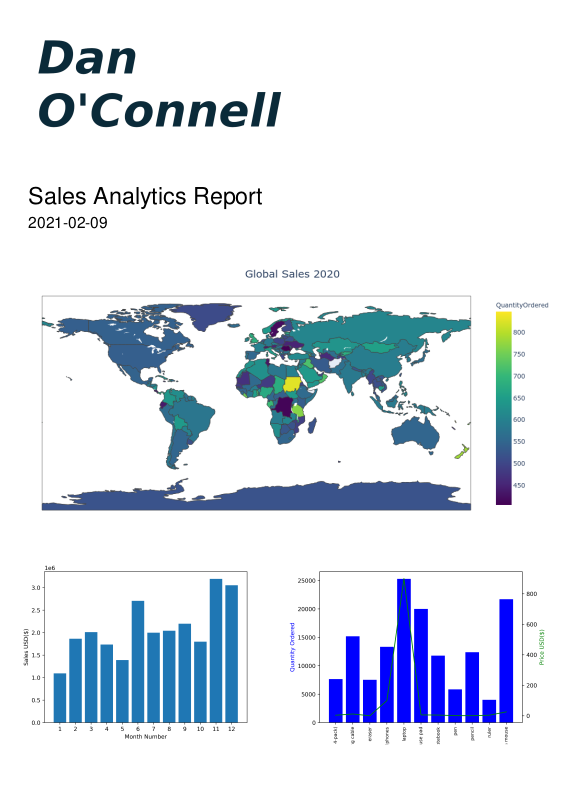

# Generate-Sales-Analytics-Report



Uses python and plotly to visualize sales data and generate a pdf report. Mock data can be generated by running `python generate_test_data.py`

## Setup

Download the code locally

```
$ git clone https://github.com/dto26/Generate-Sales-Analytics-Report.git
```

Make sure to install all the necessary libraries.

```
$ pip install fpdf pandas numpy matplotlib
$ pip install plotly
$ pip install pycountry
$ pip install -U kaleido
```

To test if everything is setup properly, try running `python generate_report.py`. You will receive a fresh report pdf.

For fresh test data, run `python generate_test_data.py`
